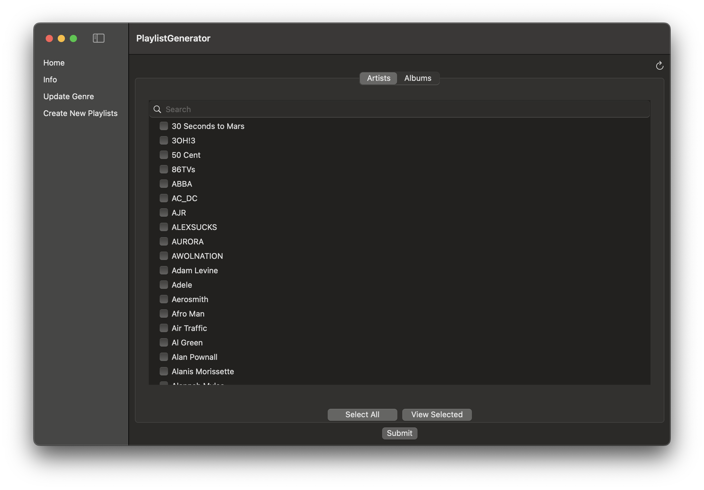
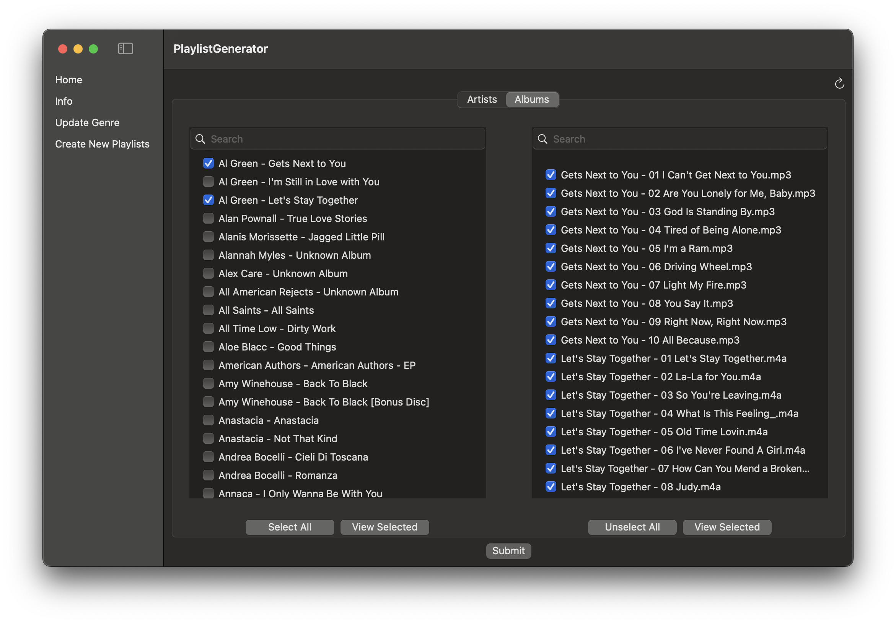
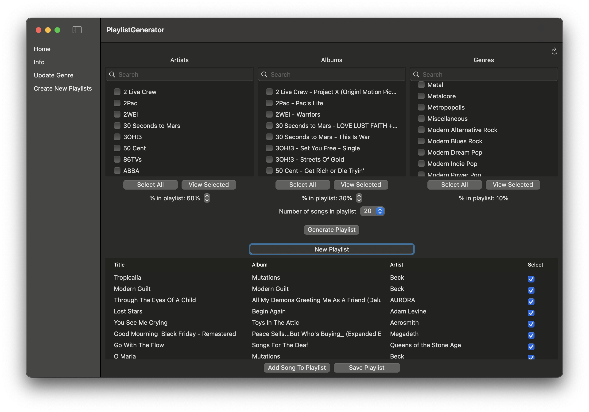

# Playlist Generator

A macOS app to update genre tags in your music library and create personalized playlists.

## Features
- Automatically fetch genre tags using the Music Brainz API.
- Update genres by artist, album, or individual song.
- Create custom playlists based on your favorite artists, albums, and/or genres.
- **Music Brainz** database is used to gather genre data (selected according to the Music Brainz popularity rating) as well as rating scores (Music Brainz user submitted scores).
    - The genre data is used to update genre tags and the rating is forms part of the playlist generating process.
- The following library is used as an mp3 metadata editor to update genre tags
    - https://github.com/chicio/ID3TagEditor
- AVFoundation is used to update non mp3 file genres

## How To Use
Firstly, the user will need to select their music library on the home page (landing screen). Once this is done the user can use the following features of the app.

## Genre Updater: 
Within the **"Update Genres"** tab you are able to update genres in your music library by artist, whole albums or specific songs. To do so you can switch between the two "Artists" and "Albums" tabs.

*Note, you will only be able to access this tab once your muis clibrary location is set*

**Where do we get the genres from?** 

For every song you want to update the genre for we will use the **Music Brainz API** to get the genre tags by the song's album. We will then chose the most popular genre (using Music Brainz's own popularity score) and update the genre using that.

**How to update your song genres** 
In the "Artists" tab you will see a list of all the artists in your library. Here you can select as many or as little artists as you want, you can also use the search bar at the top to help you easily find artists. Once you have found the artists you want to update the genres just hit submit and the app will do the rest of the work. The app will cycle through every song for that artists you checked and update the genres. 
In the "Album" tab you can select a number of albums and the right hand table will populate with all the songs for that album. By default all of these songs will be selected. However, you are able to uncheck as many or as little songs as you like. Once you've finalised the list. All the checked songs will then have their genres updated.

## Creating Playlists:

To generate playlists you can choose from a combination of artists, genres and albums. The songs that make up the users selection will be randomised and then the playlist generator will select one song from each artist/album/genre according to their rating in the Music Brainz's database (which uses user review scores). This will then loop until the playlist is populated.

The user will be able to further ccustomise the playlist by dictating how much oif the playlist should be taken up by the specific artist, albums and genres selected (done as a % of the overall).

Once the playlist is generated the user can view the osngs suggested and toggle a checkbox to say if they want that to be in the playlist when they hit the save button. The user can also add their own selection of songs ot the playlist too.

Once the user is happy they simply save the playlist and this will now appear in the Apple Music app. 

Finally, once you are happy with your selections you simply need to hit "Generate Playlist" and then a playlist will be generated for you.

